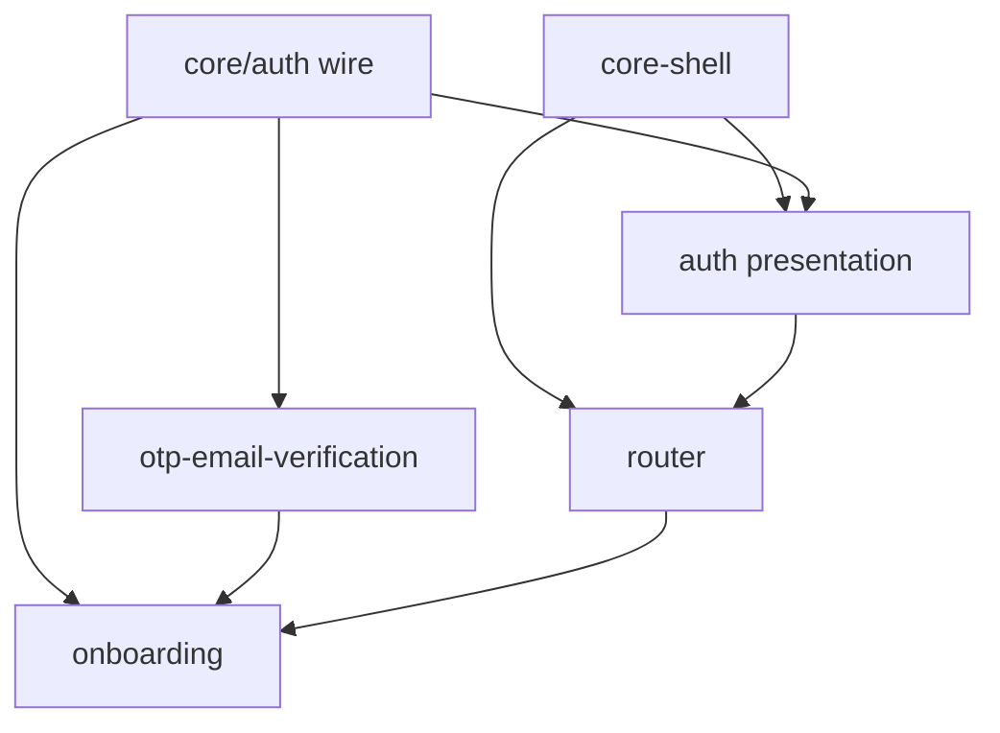

# leo-workstation — Cross-spec audit

**Date:** 2026-07-11  
**Scope:** P1 specs (`core-shell`, `auth`, `router`) + P2 onboarding (`onboarding`, `otp-email-verification`) + invariants + taskgraphs  
**Verdict:** **PASS** — safe to start [`v0.0.1-p2-onboarding-taskgraph`](phases/v0.0.1-p2-onboarding-taskgraph.md)

---

## Summary

| Category | Count |
|---|---|
| DRIFT (fixed this session) | 12 |
| AMBIGUOUS (documented, non-blocking) | 4 |
| OPEN (tracked, no spec conflict) | 4 |

---

## Contract alignment (frozen)

### AuthState (`INV-CLIENT-STATE-2`)

All specs agree:

```
unauthenticated(forgotPasswordSending?, resendCodeSending?, emailVerificationPending?)
· loading(reason?)
· error(message)
· mfaRequired(firstLogin, enrollmentToken?, otpauthUrl?, secret?)
· authenticated(role, tenantId?, onboardingRequired)
```

**Sources:** `invariants-client.md`, `auth.md`, `router.md`, `auth_state.dart`, P1/P2 taskgraphs.

### Auth wire (`INV-CLIENT-AUTH-REPO-1`)

| Endpoint | Owner |
|---|---|
| `/auth/login`, `/auth/mfa/enroll`, `/auth/refresh`, `/auth/logout` | `core/auth` |
| `/auth/signup`, `/auth/verify-email`, `/auth/resend-verify` | `core/auth` |
| `/auth/forgot-password`, `/auth/reset-password/verify`, `/auth/reset-password` | `core/auth` |
| `/invitations/accept` | `core/auth` |
| `/catalog/*`, `/interpreter-profiles/me`, `/organizations/me`, `/invitations` | `OnboardingRepository` |

### Router redirect

| Rule | Spec | Code |
|---|---|---|
| `emailVerificationPending` → `/verify-email` | router AC-6, otp AC-1 | `redirect.dart` |
| Authenticated on public → role home | router AC-5 | `redirect.dart` |
| Context guards centralized | `INV-CLIENT-ROUTE-GUARD-1` | `route_guards.dart` |
| `platform_admin` rejected at mint | `INV-CLIENT-ROUTE-2` | `auth_notifier._applySession` |
| No `/web-handoff` | router, auth, core-shell | removed from routes |

### Public routes

Union of `authPublicRoutes` ∪ `onboardingPublicRoutes`:

`/login`, `/forgot-password`, `/forgot-password/verify`, `/reset-password`, `/invite/accept`, `/signup`, `/signup/details`, `/verify-email`

---

## DRIFT resolved (2026-07-11)

| # | Was | Now |
|---|---|---|
| 1 | P1 taskgraph: `pickMembership`, `/select-workspace` | Removed; taskgraph revised + `status: shipped` |
| 2 | P1 taskgraph: `platform_admin → /web-handoff` | Rejected at mint; no route |
| 3 | P1 taskgraph: `AuthRepository` in `features/auth` only | `core/auth` + re-export |
| 4 | `core-shell.md`: `webAdminBaseUrl` feeds web-handoff | Chrome external link only |
| 5 | `onboarding.md`: magic-link verify | OTP in-app (`otp-email-verification.md`) |
| 6 | Wire path `resend-verify-email` | `POST /auth/resend-verify` (matches leo-api alpha.6) |
| 7 | Wire path `verify-reset-code` | `POST /auth/reset-password/verify` |
| 8 | `features/INDEX.md`: otp area column wrong | `core/auth` wire · onboarding+auth presentation |
| 9 | `phases/INDEX.md`: alpha.4 multi-membership picker | Client catches up via single-membership + D1/D2 cut |
| 10 | `v0.0.1-alpha.1.md`: multi-membership success criteria | Amended — picker cut; tenant-less retained |
| 11 | Missing `INV-CLIENT-AUTH-REPO-1`, `INV-CLIENT-ROUTE-GUARD-1` | Added to invariants |
| 12 | No P2 orchestration target | Created `v0.0.1-p2-onboarding-taskgraph` |

---

## AMBIGUOUS (non-blocking — documented in specs)

| Item | Resolution |
|---|---|
| **Remember device** | Open in `auth.md` / `otp-email-verification.md` — no wire impact |
| **Interpreter MFA before affiliation** | Open in `onboarding.md` — confirm with product/backend |
| **`onboarding_required` JWT claim** | Local completion storage interim; confirm server signal |
| **Affiliation step** | Copy + idle note only; full feature deferred to alpha.5 affiliations slice |

---

## OPEN (cross-repo — do not block taskgraph)

Track in backend/product backlog:

1. Memberships-list endpoint (workspace switcher revival — `auth.md` D2)
2. `interpreter-profiles` + cert proof upload timing (`onboarding.md`)
3. Production OTP email template copy
4. Server-derived `onboardingRequired` (replace local storage when `/auth/me` or claim lands)

---

## Spec dependency graph



---

## Recommended next step

```text
/pineapple:orchestrate v0.0.1-p2-onboarding
```

Start at **P2-O-T-01** (alpha.6 OTP wire integration verify) — most scaffold is on disk; taskgraph focuses on integration smoke + E2E gates.
