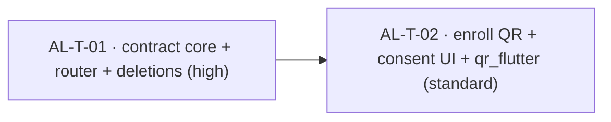

# Taskgraph — `v0.0.1-alpha.1-auth-live` (auth contract correction)

> **Status: approved 2026-06-30.** QR package locked: `qr_flutter` (D7).
>
> Implements D1–D7 from the corrected [`features/auth.md`](../features/auth.md):
> replace the assumed-contract auth scaffolding with the live backend contract
> (verified 2026-06-30 against `localhost:3000/api/v1` `/api/docs-json` + `leo-api`
> source). This is a **follow-on to the merged `v0.0.1-alpha.1` taskgraph** (PRs
> #7–#11), not a re-run — the auth slice exists but was built against the wrong wire
> contract.

## Why this is two tasks (and not three, or one)

The single load-bearing fact: removing the `AuthState.pickMembership` arm and
changing `acceptInvite`'s signature **breaks consumers in two areas at once** —
`features/auth` (notifier, ui-provider, screens) *and* `core/router`
(`redirect.dart`'s exhaustive `switch`, `app_router.dart`'s `/select-workspace`
route, `redirect_test.dart`). `INV-CLIENT-STATE-2` codifies this: changing an arm is
"a contract change to both specs." So the contract change + every reference it breaks
must land **together** to stay `flutter analyze`-clean — they cannot be split into
independently-buildable parallel tasks. That coupled change is **AL-T-01** (the
foundation; owns the narrowed contract). What's genuinely separable is the mechanical
view work that sits *on top* of the new contract — real MFA-enrollment QR, invite
consent UI, the `qr_flutter` dependency — that's **AL-T-02**, which branches off
AL-T-01 once merged. No parallel pair exists, so there is no `safeParallelWith`
concern.

## Waves

| Wave | Gate | Tasks |
|---|---|---|
| **W1 — Contract core** | manual | AL-T-01 |
| **W2 — View + dependency** | auto (fires when W1 clears) | AL-T-02 |

## Tasks

| ID | Title | Area | Surface | Model | Depends on | Verify |
|---|---|---|---|---|---|---|
| **AL-T-01** | Live auth contract: repository/state-machine rewrite + router alignment + deletions | `features/auth` ⋂ `core/router` | frontend | high | — | auto |
| **AL-T-02** | MFA-enrollment QR + invite consent UI + `qr_flutter` dependency | `features/auth` | frontend | standard | AL-T-01 | manual |

### AL-T-01 — Live auth contract core (foundation; owns the narrowed `AuthState`)

**Spec:** [`features/auth.md`](../features/auth.md) (D1–D6). **Model:** high — invariant-heavy state machine + redirect loop-safety + token/password-handling discipline.

This task owns the phase **integration contract**: the narrowed `AuthState` union and
the live wire shapes. It must merge before AL-T-02 fans out. Because it edits the
cross-feature `AuthState`/redirect contract, it routes **coordinator-side on `main`**
(matching this repo's existing `coordinator-side-serial` mode), not an isolated worker
worktree.

**Scope (files):**
- `data/auth_repository.dart` — `ApiAuthRepository.login` gains optional `totpCode`; returns a result distinguishing `enrollmentRequired` (carries `otpauthUrl`/`secret`/`enrollmentToken`) from `mfaRequired` (flag only); `mfa/enroll` call added; **delete** `selectMembership`/`switchTenant`/`listMemberships`; `acceptInvite` sends nested `consent {tos, privacy, baa_ack}`.
- `domain/auth_entities.dart` — **delete** `LoginResult.pickMembership` arm; enrollment payload on the MFA-required result.
- `presentation/state/auth_state.dart` (+ freezed regen) — **delete** `AuthState.pickMembership` arm; **delete** workspace fields (`memberships`, `membershipsLoading`, `switchingTenant`, `expandedPrivilegedTenantId`) from `authenticated`; `mfaRequired` carries enrollment payload when present.
- `presentation/notifiers/auth_notifier.dart` — hold `_pendingEmail`/`_pendingPassword` in volatile state across the MFA round-trip; clear on success/failure/exit; `submitMfa` resubmits `login(email, password, totpCode: code)`; **delete** `loadMemberships`/`switchTenant`/`setExpandedPrivilegedTenant`/`selectMembership`; remove `LoginPickMembership` case.
- `presentation/providers/auth_ui_provider.dart` — drop `pickMemberships` + workspace fields + the `AuthPickMembership` case; expose `otpauthUrl`/`mfaSecret` for AL-T-02's QR.
- `core/router/redirect.dart` — remove the `AuthPickMembership` arm from the exhaustive switch; remove `/select-workspace` from the public/known-location lists.
- `core/router/app_router.dart` — remove the `/select-workspace` `GoRoute` + the `tenant_picker_screen` import.
- **Delete** `presentation/screens/tenant_picker_screen.dart`, `presentation/widgets/workspace_switcher.dart`; remove the `WorkspaceAvatarButton` mount in `presentation/screens/role_shell_screen.dart`.
- `test/core/router/redirect_test.dart` — update the existing test to the new table (no `/select-workspace`, no `pickMembership`). *(Fixing an existing broken test, not adding new ones — within `INV-CLIENT-TEST-1`.)*
- Doc amendments: `INV-CLIENT-STATE-2` (arm list) and `INV-CLIENT-ROUTE-2` (drop the `/select-workspace` clause) in `.pineapple/invariants-client.md`.

**Acceptance criteria:**
- Login persists tokens and redirects to the role home with no manual navigation; a 0-membership interpreter gets a tenant-less token (`role: interpreter`, no `tenant_id`) and lands on `/idle` (spec AC-1, `INV-CLIENT-AUTH-3`).
- Privileged + MFA-unsatisfied login yields `enrollmentRequired` (first time) or `mfaRequired` (enrolled); `submitMfa` resubmits the held `email`+`password`+`totp_code` to `/auth/login`; no `/auth/mfa` path and no `mfa_token` exist anywhere (spec AC-2).
- The held password is never written to disk/secure storage/logs and is cleared from notifier state immediately after the MFA round-trip resolves or on navigating away (spec AC-3, `INV-CLIENT-PHI-1`).
- Refresh token in `flutter_secure_storage`, access token in memory; `AuthNotifier` is the sole writer of `currentAccessTokenProvider`; logout clears both; cold start restores or routes to `/login` (spec AC-4, `INV-CLIENT-AUTH-1/-4`).
- `acceptInvite` sends `token`+`password`+nested `consent {tos, privacy, baa_ack}`; the repository never issues the call without all three present (spec AC-6, repo half).
- No code path references `listMemberships`/`selectMembership`/`switchTenant`/`pickMembership`/`/select-workspace`; `tenant_picker_screen.dart` and `workspace_switcher.dart` are deleted (spec AC-7, D1/D2).
- `redirect.dart`'s switch is exhaustive over the *narrowed* `AuthState`; no redirect loop across any (state × location) pair (`redirect_test` passes).
- `INV-CLIENT-STATE-2` and `INV-CLIENT-ROUTE-2` updated to match the narrowed contract.

**Verification (auto):** `dart run build_runner build --delete-conflicting-outputs` (freezed regen) · `flutter analyze` clean · existing `test/core/router/redirect_test.dart` passes.

### AL-T-02 — MFA-enrollment QR + invite consent UI + dependency

**Spec:** [`features/auth.md`](../features/auth.md) (D3 enroll UI, D6 consent UI, D7). **Model:** standard — mechanical view work + a pub dependency, on top of AL-T-01's contract.

**Scope (files):**
- `pubspec.yaml` — add `qr_flutter` (D7, locked 2026-06-30). This task's approval is the new-dependency sign-off.
- `presentation/screens/mfa_screen.dart` — `MfaEnrollScreen` renders a real scannable QR from the server's `otpauth_url` (via `authUiProvider.otpauthUrl`) + the manual key from `secret`; **delete** the hardcoded `_backupCodes` grid and `_QrPlaceholder` checkerboard.
- `presentation/screens/reset_password_screen.dart` — `InviteAcceptScreen` gains `tos`/`privacy`/`baa_ack` consent checkboxes (all required to enable submit) wired into `acceptInvite`.
- `l10n/auth_strings.dart` — remove backup-code/workspace-switch strings; add consent-checkbox copy (`INV-CLIENT-I18N-1`).

**Acceptance criteria:**
- `MfaEnrollScreen` displays a real QR encoding the server `otpauth_url` (scannable by a standard authenticator app) plus the manual `secret`; no backup-codes UI remains (spec AC-2 enroll half, AC-7 backup-codes half, D3/D7).
- `InviteAcceptScreen` renders three required consent checkboxes and submit stays disabled until all are checked; the wired `acceptInvite` carries them (spec AC-6, UI half).
- New user-facing copy goes through `intl`; no string literals in widgets (`INV-CLIENT-I18N-1`); semantics on the checkboxes and QR affordance (`INV-CLIENT-A11Y-1`).
- `flutter analyze` clean with `qr_flutter` added.

**Verification (manual):** `flutter analyze` clean · manual smoke — scan the enrollment QR with a real authenticator and confirm the generated code completes enrollment; confirm invite-accept blocks submit until all three consents are checked.

## DAG

## Dependencies

- `AL-T-01` → `[]` (starts immediately; foundation, coordinator-side on `main`).
- `AL-T-02` → `[AL-T-01]` (branches off `main` after AL-T-01 merges; consumes the new contract + `authUiProvider.otpauthUrl`).

## Reviewer notes

- **DAG is acyclic** (single edge AL-T-01 → AL-T-02). No independent branches → no parallel dispatch, no `safeParallelWith` evaluation needed; the chain is two deep, which is acceptable for a 2-task corrective phase.
- **Integration contract** (narrowed `AuthState` union + live wire shapes) is fixed and owned solely by **AL-T-01**, which merges before AL-T-02 fans out. ✔
- **Foundation / cross-area edit:** AL-T-01 spans `features/auth` ⋂ `core/router` because it edits the shared `AuthState`/redirect contract — routes coordinator-side on `main`, not a worker worktree, consistent with this repo's `coordinator-side-serial` mode.
- **Invariant compliance:** no task violates an invariant. AL-T-01 *amends* `INV-CLIENT-STATE-2` and `INV-CLIENT-ROUTE-2` deliberately (the contract narrowed); these amendments are in-scope and listed as ACs. No new tests added (`INV-CLIENT-TEST-1`); the one existing test touched is repaired, not extended.
- **`human_admin`:** none — no DNS/secrets/paid accounts. `qr_flutter` is a normal pub dependency (sign-off rides on AL-T-02 approval).
- **Resolved at approval (2026-06-30):** QR package locked to `qr_flutter`.

---

After approval: **`/pineapple:orchestrate v0.0.1-alpha.1-auth-live`**.
