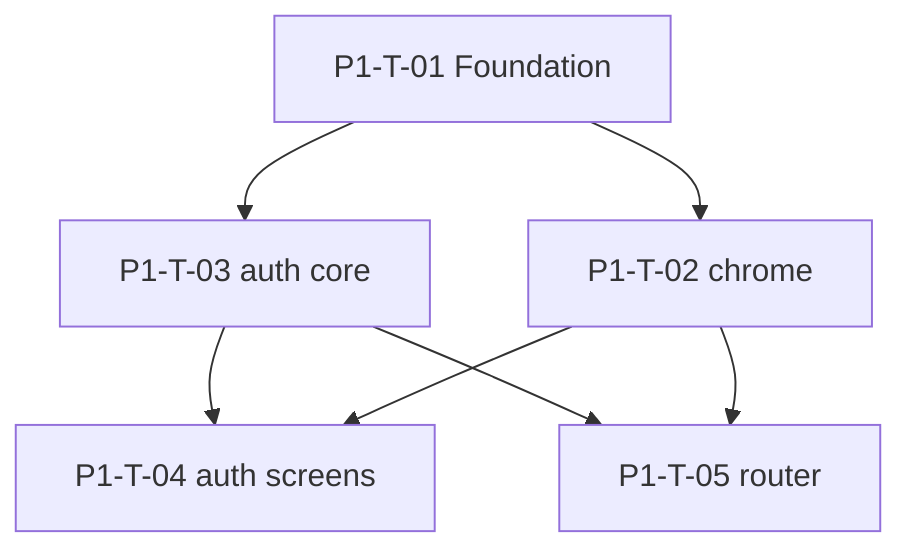

# Taskgraph — `v0.0.1-alpha.1` (App shell)

> **Status: SHIPPED** (revised 2026-07-11 against live specs + as-built code).
> Historical dispatch doc — do not re-orchestrate unless regressing P1.
> **Next orchestration:** [`v0.0.1-p2-onboarding-taskgraph.md`](v0.0.1-p2-onboarding-taskgraph.md).

Phase: core-shell + auth + router. Realtime deferred; onboarding signup/verify
scaffolded early but **owned by P2 taskgraph**.

## Integration contract (P1-T-01)

| Aspect | Contract |
|---|---|
| Base URLs / env | `apiBaseUrl`, `realtimeWsUrl`, `webAdminBaseUrl` from `.env` |
| Auth/token | Bearer from `currentAccessTokenProvider` (`INV-CLIENT-AUTH-4`); refresh in secure storage |
| Wire layer | `lib/core/auth/` — all `/auth/*` (`INV-CLIENT-AUTH-REPO-1`) |
| Wire casing | snake_case → camelCase via DTOs/entities; `tenant_id` optional |
| Transport | `dioProvider` + cert pin (`INV-CLIENT-NET-1`) |
| State contract | `AuthState` per `INV-CLIENT-STATE-2` — includes `emailVerificationPending` |
| Role→home | `INV-CLIENT-ROUTE-2`; `platform_admin` rejected at mint (no `/web-handoff`) |

## Waves

| Wave | Gate | Tasks |
|---|---|---|
| **W1 — Foundation** | manual | P1-T-01 |
| **W2 — Shell + auth core** | manual | P1-T-02, P1-T-03 |
| **W3 — Auth screens + router** | auto | P1-T-04, P1-T-05 |

## Tasks

| ID | Title | Spec | Area | Status |
|---|---|---|---|---|
| **P1-T-01** | core-shell Foundation | `core-shell.md` | `core` | ✅ |
| **P1-T-02** | Shell chrome | `core-shell.md` | `core/shell` | ✅ |
| **P1-T-03** | auth core (`core/auth` + `AuthNotifier`) | `auth.md` | `core/auth`, `features/auth` | ✅ |
| **P1-T-04** | auth screens (no picker/switcher) | `auth.md` | `features/auth` | ✅ |
| **P1-T-05** | router + redirect + guards | `router.md` | `core/router` | ✅ |

## DAG

## Acceptance criteria (summary)

See [`v0.0.1-alpha.1-taskgraph.yml`](v0.0.1-alpha.1-taskgraph.yml) for machine-readable AC.

**Removed from original 2026-06-29 draft (superseded by auth-live + 2026-07-11 audit):**
- `pickMembership` / `/select-workspace` / tenant picker / workspace switcher
- `switchTenant` / multi-membership login
- `/web-handoff` for `platform_admin`
- `mfaToken` field name (use `enrollmentToken` on `mfaRequired` arm)

**Added in revisions:**
- `core/auth` shared wire (`INV-CLIENT-AUTH-REPO-1`)
- `emailVerificationPending` router metadata (A1)
- Authenticated-on-public → role home (A2)
- Centralized `route_guards.dart` (INV-CLIENT-ROUTE-GUARD-1)
- Two-step password reset (`/auth/reset-password/verify` → `reset_ticket`)
