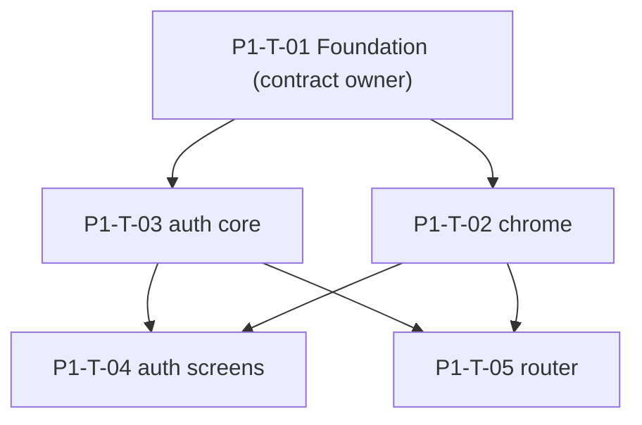

# Taskgraph — `v0.0.1-alpha.1` (App shell)

> **Status: APPROVED 2026-06-29 (human) — ready to dispatch.**
> Run `/pineapple:orchestrate v0.0.1-alpha.1`. Issues + PRs in `saambaby/leo-workstation`.

Phase: core-shell + auth + router (realtime & onboarding deferred — see
[`v0.0.1-alpha.1.md`](v0.0.1-alpha.1.md)). 5 tasks, 3 waves, two parallel branches.

## Integration contract (fixed by **P1-T-01** before any fan-out)

| Aspect | Contract |
|---|---|
| Base URLs / env | `apiBaseUrl`, `realtimeWsUrl`, `webAdminBaseUrl` from `.env` (`flutter_dotenv`) |
| Auth/token | Bearer from `currentAccessTokenProvider` (in-memory; `INV-CLIENT-AUTH-4`); refresh in `flutter_secure_storage`, access in memory (`INV-CLIENT-AUTH-1`) |
| Wire-format | snake_case on the wire → camelCase entities via `@JsonKey` on DTOs/entities; `exp`/`iat` Unix-seconds **numbers**; `tenant_id` optional/absent (`INV-CLIENT-AUTH-3`); signup `organization_id` present-as-null |
| Transport | single `dioProvider` (baseUrl + Bearer interceptor + SHA-256 cert pin, `INV-CLIENT-NET-1`) |
| State contract | `AuthState` union frozen (`INV-CLIENT-STATE-2`); role→home + `/select-workspace` (`INV-CLIENT-ROUTE-2`) |

## Waves

| Wave | Gate | Tasks |
|---|---|---|
| **W1 — Foundation** | manual | P1-T-01 |
| **W2 — Shell + auth core** | manual (review the contract before fan-out) | P1-T-02, P1-T-03 |
| **W3 — Auth screens + router** | auto | P1-T-04, P1-T-05 |

## Tasks

| ID | Title | Spec | Area | Surface | Model | Depends on | Verify |
|---|---|---|---|---|---|---|---|
| **P1-T-01** | core-shell Foundation: bootstrap, config, dio+seam+cert-pin, token storage, DeviceClass, theme | `core-shell.md` | `core` | frontend | high | — | auto |
| **P1-T-02** | Shell chrome: `WorkstationScaffold` (header + rail slots + tenant-chip/avatar mount + lsp_admin admin-link) | `core-shell.md` | `core/shell` | frontend | standard | P1-T-01 | auto |
| **P1-T-03** | auth core: `AuthRepository`, `AuthState` union, `AuthNotifier` state machine, session restore, token-holder writes | `auth.md` | `features/auth` | frontend | high | P1-T-01 | auto |
| **P1-T-04** | auth screens: login · mfa · mfa_enroll · tenant_picker(`/select-workspace`) · forgot · reset · invite_accept + in-app workspace switcher | `auth.md` | `features/auth` | frontend | standard | P1-T-03, P1-T-02 | auto + manual |
| **P1-T-05** | router: `routerProvider`, pure `redirect` (table + loop-safety test), refresh-listenable bridge, route tree + placeholder role homes + device gating + `/web-handoff` | `router.md` | `core/router` | frontend | high | P1-T-03, P1-T-02 | auto |

## DAG

## Acceptance criteria (per task)

**P1-T-01 — Foundation**
- `main()` wraps the app in `ProviderScope`; `LeoApp` builds `CupertinoApp.router`; `flutter analyze` clean; app boots.
- `appConfigProvider` exposes `apiBaseUrl`/`realtimeWsUrl`/`webAdminBaseUrl` from `.env`.
- `dioProvider` baseUrl from config; request interceptor injects `Authorization: Bearer <token>` from `currentAccessTokenProvider` when non-null, omits when null.
- `badCertificateCallback` returns `true` only on SHA-256 pin match (rotation list) (`INV-CLIENT-NET-1`); a dev escape hatch is gated to debug builds (`kDebugMode`) when no pins are configured and never ships enabled in release.
- `currentAccessTokenProvider` defined here (in-memory, default `null`); core-shell never writes it (`INV-CLIENT-AUTH-4`).
- `tokenStorageProvider` reads/writes/clears the refresh token in `flutter_secure_storage` only; never logged (`INV-CLIENT-AUTH-1`, `-PHI-1`).
- `deviceClassProvider` derives `{desktop,tablet,smartphone}` from `MediaQuery` (documented breakpoints); updates on resize (`INV-CLIENT-DEVICE-1`).
- `app_theme` provides light/dark/**night** `CupertinoThemeData` from the design tokens; dark default; brightness persisted + restored (`INV-CLIENT-UI-1`).
- *Verify:* `flutter analyze` + unit tests (Bearer inject/omit, cert-pin callback, token-storage round-trip, DeviceClass breakpoints, config defaults).

**P1-T-02 — Shell chrome**
- `WorkstationScaffold` renders the header (tenant-chip slot + avatar mount) + rail slots; per-role rail *contents* are injected, not owned here.
- The rail-footer "Admin dashboard" link renders **only** for role `lsp_admin` and only when `webAdminBaseUrl` is set; opens it externally (`url_launcher`) (`INV-CLIENT-ROUTE-1`).
- Semantics on chrome controls (`INV-CLIENT-A11Y-1`); user-facing copy via `intl` (`INV-CLIENT-I18N-1`).
- *Verify:* `flutter analyze` + widget tests (admin link visible only for `lsp_admin` + url set; slots render).

**P1-T-03 — auth core**
- `AuthState` union exactly per `INV-CLIENT-STATE-2`: `unauthenticated · loading · error(message) · mfaRequired(firstLogin, mfaToken) · pickMembership(memberships) · authenticated(role, tenantId?, onboardingRequired)`.
- `AuthNotifier` transitions: single-membership login → authenticated; multi → pickMembership; 0-membership interpreter → tenant-less authenticated (`tenantId == null`, `INV-CLIENT-AUTH-3`); privileged → mfaRequired (first login → enroll); `switchTenant` re-mints (404 on non-held); logout clears.
- `AuthNotifier` is the **sole writer** of `currentAccessTokenProvider` (mint/refresh/switch set; logout clears) (`INV-CLIENT-AUTH-4`).
- `AuthRepository` maps snake_case → camelCase `AuthSession`; coercions applied (`exp` seconds, `tenant_id` optional); `ApiAuthRepository` calls live endpoints.
- `build()` restores session from secure storage on cold start.
- *Verify:* `flutter analyze` + unit tests over every transition + token-holder writes.

**P1-T-04 — auth screens**
- Screens render (Cupertino, dark): `/login`, `/mfa`, `/mfa/enroll`, `/select-workspace` (`tenant_picker_screen`), `/forgot-password`, `/reset-password`, `/invite/accept`.
- Login picker: whole row is the tap target. In-app switcher: avatar opens the menu over the live chrome; privileged switch expands inline 6-cell OTP (`auth.md` affordances).
- `/forgot-password` always shows the same "if that email exists…" result (no enumeration).
- Error → copy mapping (`401 → "Invalid email or password"`); semantics + `intl`.
- *Verify:* `flutter analyze` + widget tests; manual smoke of each screen.

**P1-T-05 — router**
- `routerProvider` → `GoRouter` whose `redirect` is the pure function over (`AuthState`, `DeviceClass`, location) re-run via `authRefreshListenableProvider` (owned here).
- Redirect implements the decision table incl. role→home (`INV-CLIENT-ROUTE-2`, incl. `customer_admin→/call`, tenant-less→`/idle`), `authenticated(onboardingRequired:true) → /onboarding/*`, device-gated → blocked-surface, `platform_admin → /web-handoff` (opens `webAdminBaseUrl`).
- **No redirect loop** across any (state × location) pair — proven by a `redirect.dart` unit test (router AC-8).
- Placeholder role-home pages mounted in `WorkstationScaffold`; customer routes hidden on smartphone (`INV-CLIENT-DEVICE-1`); no admin routes (`INV-CLIENT-ROUTE-1`).
- *Verify:* `flutter analyze` + unit test of `redirect.dart` against the full table (loop-free).

## Reviewer notes

- **Parallelism is file-isolated** (the client `code-map.md` has no `safeParallelWith` matrix): W2 pairs `core/shell` (T-02) ∥ `features/auth` (T-03) — disjoint dirs; W3 pairs `features/auth` (T-04) ∥ `core/router` (T-05) — disjoint dirs. T-03/T-04 share `features/auth` but are sequential (T-04 depends on T-03), so never concurrent.
- **No `human_admin` tasks.** Real staging base URLs + cert-pin SHA-256 values are needed to run against live `leo-api` — supply real values at integration time.
- **No platform/Foundation edits to a shared `main` branch** — this is greenfield client code; T-01 is the in-repo Foundation and is wave-1-alone.
- **Pre-task setup:** the `pubspec.yaml` dependency stack (`flutter_riverpod`, `go_router`, `dio`, `flutter_secure_storage`, `freezed`/`json_serializable`, `url_launcher`, `intl`; dev `build_runner`, `riverpod_generator`) must be added — fold into T-01 (it's the Foundation) or as a pre-step. Adding deps is a "check-in-first" item per `CLAUDE.md`; treat T-01 approval as that sign-off.
- DAG is acyclic; two independent branches in W3; deepest chain is T-01→T-03→{T-04|T-05} (3). Reviewable in one sitting.
