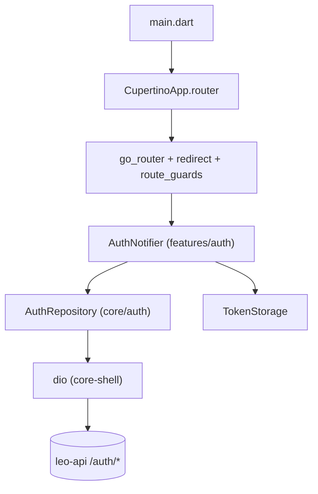

# P1 — `v0.0.1-alpha.1` — App shell

**Goal / existential question:** *Can every ops role log in against the **live auth
contract**, land on the correct workstation home, and navigate via a loop-free
redirect — with secure token storage, cert-pinned API, and no WSS yet?*

**Status: SHIPPED** (revised 2026-07-11). Driver:
[`docs/release-plan.md`](../../docs/release-plan.md) § `v0.0.1-alpha.1`.

## In-scope (3)

| Feature | Delivers | Spec |
|---|---|---|
| **core-shell** | `ProviderScope`, `AppConfig`, Cupertino theme, `DeviceClass`, cert-pinned `dio`, `TokenStorage`, shared chrome | [`features/core-shell.md`](../features/core-shell.md) ✅ |
| **auth** | Login, MFA, session restore, logout, forgot/reset OTP, invite — presentation in `features/auth`, wire in `core/auth` | [`features/auth.md`](../features/auth.md) ✅ |
| **router** | `go_router` + pure redirect (auth × device × location), role homes, context guards | [`features/router.md`](../features/router.md) ✅ |

## Out-of-scope (deferred)

- **realtime** (WSS) — deferred 2026-06-29; lands before/with full P2 MVP.
- **onboarding** (signup/verify/wizards) → **P2 taskgraph**
  [`v0.0.1-p2-onboarding-taskgraph.md`](v0.0.1-p2-onboarding-taskgraph.md).
- Vonage/session, dispatch data, customer call → P2 MVP.
- Admin/back-office, LSP onboarding → `leo-web` (`INV-CLIENT-ROUTE-1`).

## Architecture (as-built)

## Contract notes (2026-07-11 audit)

- **No** pre-login membership picker or in-app workspace switcher (`auth.md` D1/D2).
- **No** `/web-handoff` — `platform_admin` rejected at session mint.
- **`emailVerificationPending`** on `AuthState` drives verify redirect (router A1).
- OTP verify/reset wire matches **alpha.6** backend paths.

## API dependencies

- `POST /auth/login`, `/auth/mfa/enroll`, `/auth/refresh`, `/auth/logout`
- `POST /auth/forgot-password`, `/auth/reset-password/verify`, `/auth/reset-password`
- `POST /invitations/accept`

Signup/verify (`/auth/signup`, `/auth/verify-email`, `/auth/resend-verify`) are
**P2 onboarding** — wired in `core/auth`, orchestrated separately.

## Success criteria / Done-when

See [`docs/release-checklists.md`](../../docs/release-checklists.md) § `v0.0.1-alpha.1`.

- [x] Login → correct role home (single-membership auto-resolve).
- [x] Tenant-less interpreter → `/idle`.
- [x] MFA enroll/challenge via login resubmit + `/auth/mfa/enroll`.
- [x] Tokens: refresh in secure storage, access in memory.
- [x] Redirect table loop-free (`redirect_test.dart`).
- [x] `platform_admin` rejected; no `superadmin` slug.
- [ ] WSS — deferred (not required at this tag).

**Cut from original alpha.4 draft:** multi-membership picker, `switch-tenant` UI — no
backend memberships-list endpoint (`auth.md` D2).
