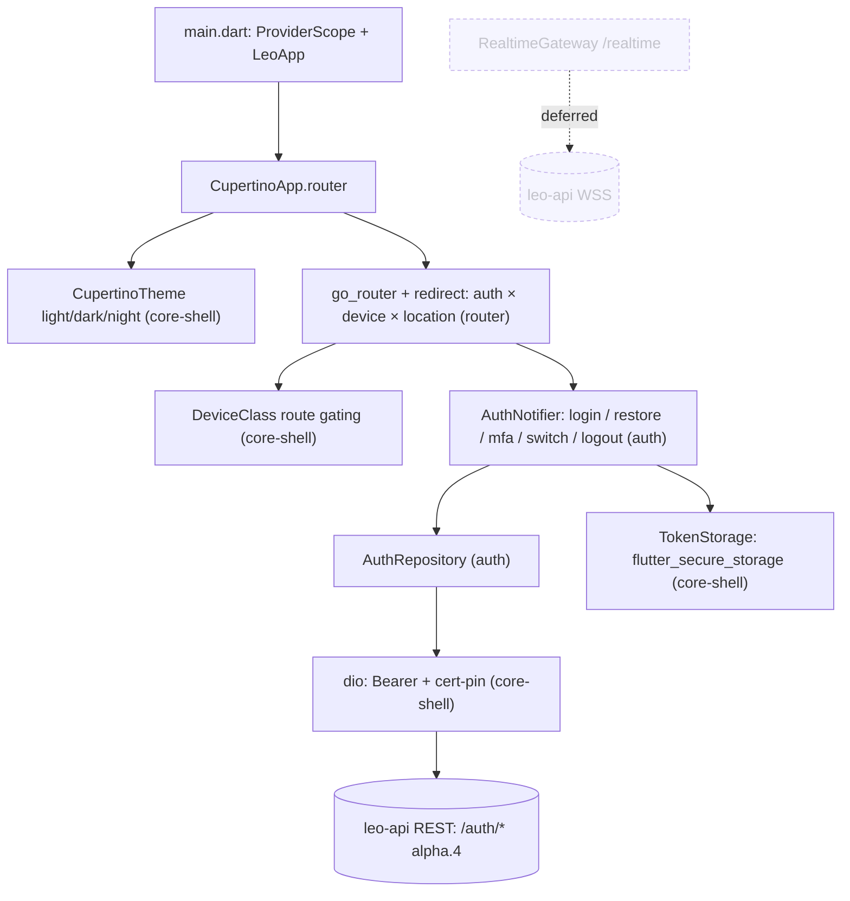

# P1 — `v0.0.1-alpha.1` — App shell

**Goal / existential question:** *Can every role log in against the **alpha.4 auth
contract** (multi-membership, tenant-less, `switch-tenant`) and land on the correct ops
workstation — with secure token storage, cert-pinned API, and role/device redirect, and
no session/media/WSS yet?*

This is the **load-bearing foundation phase**: it proves the riskiest client assumption
(the alpha.4 identity contract renders correctly in Flutter) and nothing else can ship
before it. Driver: [`docs/release-plan.md`](../../docs/release-plan.md) § `v0.0.1-alpha.1`.
Client map: [`docs/client-map.md`](../../docs/client-map.md). Architecture:
[`docs/architecture-overview.md`](../../docs/architecture-overview.md).
Re-carved 2026-06-29: **realtime deferred** (see below).

## In-scope (3)

| Feature | Delivers | Spec |
|---|---|---|
| **core-shell** | `ProviderScope`, `AppConfig`, Cupertino theme (light/dark/night), `DeviceClass`, cert-pinned `dio`, `TokenStorage`, shared chrome | [`features/core-shell.md`](../features/core-shell.md) ✅ |
| **auth** | Login, session restore, logout, MFA enroll/challenge, secure token storage — **alpha.4 contract** (multi-membership picker, tenant-less, `switch-tenant`, `platform_admin`) | [`features/auth.md`](../features/auth.md) ✅ |
| **router** | `go_router` + pure redirect (auth × device × location), role homes, device gating | [`features/router.md`](../features/router.md) ✅ |

## Out-of-scope (deferred)

- **realtime** (Socket.IO `/realtime`, `notification.push`, reconnect) — **deferred 2026-06-29**; the shell does not hold a WSS channel at this tag. Spec pending; lands before/with P2.
- **onboarding** (signup/verify/native onboarding) → **P2 `v0.0.1`** ([`features/onboarding.md`](../features/onboarding.md)).
- Vonage/session screens, dispatch queue data, customer call flow, customer mobile, full `sub_admin` RBAC split → P2/P3.
- Any admin/back-office or LSP-onboarding surface → `leo-web` (`INV-CLIENT-ROUTE-1`).

## Strict-subset architecture (scaffold ⊂ alpha.1 ⊂ target)

> Subset of [`docs/architecture-overview.md`](../../docs/architecture-overview.md)
> §1–§5, §7: core-shell + auth + router only. Realtime (dashed) is deferred; no
> session, Vonage, dispatch, onboarding, or customer-mobile surfaces (P2/P3).

## API dependencies (`../leo-api`, already shipped alpha.1–alpha.5)

- `POST /auth/login` (active-tenant token, or tenant-less for a 0-membership interpreter)
- `POST /auth/refresh`, `/auth/logout`, `/auth/mfa`, `/auth/mfa/enroll`
- `POST /auth/switch-tenant` (re-mint on tenant change; MFA re-challenge for privileged roles)
- `POST /auth/forgot-password`, `/auth/reset-password`, `/invitations/accept`

Contract detail: [`docs/platform-references.md`](../../docs/platform-references.md)
→ `../leo-api/docs/release-plan.md` § alpha.4.

## Success criteria / Done-when

See [`docs/release-checklists.md`](../../docs/release-checklists.md)
§ `v0.0.1-alpha.1` and § `v0.0.1-alpha.4`. Headline:

- [ ] Login → correct role home with no manual navigation.
- [ ] **Multi-membership** login → tenant/membership picker → correct role home.
- [ ] **Tenant-less** interpreter (0 memberships) → `/idle` without error.
- [ ] `switch-tenant` re-mints token; MFA re-challenged for `platform_admin`/`lsp_admin`/`sub_admin`.
- [ ] Tokens: refresh in `flutter_secure_storage`, access in memory (`INV-CLIENT-AUTH-1`); cert pin enforced (`INV-CLIENT-NET-1`).
- [ ] Redirect table has no loop across any (auth-state × location) pair (`router` AC-8).
- [ ] `flutter analyze` clean; semantics on login + shells.
- [ ] Customer routes hidden on smartphone (`DeviceClass`, `INV-CLIENT-DEVICE-1`).
- [ ] No `superadmin` slug anywhere — `platform_admin` only.
- [ ] *(Not required at this tag: WSS `notification.push` — moved to realtime.)*
