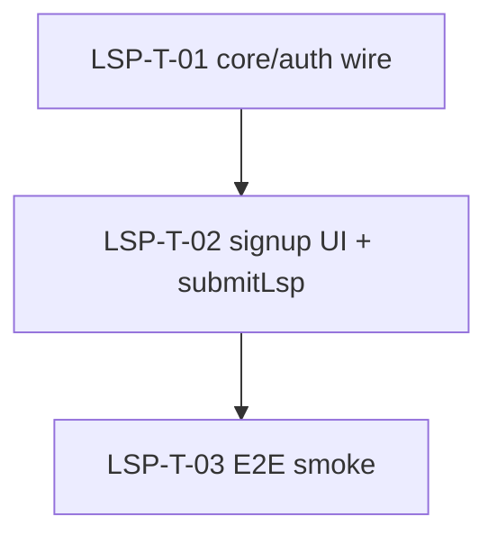

# Taskgraph — `v0.0.1-p2-onboarding-lsp` (In-app LSP signup)

> **Status: approved (Gate 1, 2026-07-11)** — ready for `/pineapple:workorders`.
> Spec: [`lsp-native-signup.md`](../features/lsp-native-signup.md).
> Prerequisite: `v0.0.1-p2-onboarding`'s OTP-verify wire + `auth`'s MFA-enroll screen
> (already shipped/running — see [`v0.0.1-p2-onboarding-taskgraph.md`](v0.0.1-p2-onboarding-taskgraph.md)).
> Machine file: [`v0.0.1-p2-onboarding-lsp-taskgraph.yml`](v0.0.1-p2-onboarding-lsp-taskgraph.yml)
> — validated (`python3 scripts/validate.py taskgraph ...` → `VALID`).

**Goal:** LSP operators sign up in-app — picker → details → OTP verify → MFA enroll →
`/dispatch` — with no backend changes, reusing `onboarding.md`'s signup screens and
`auth.md`'s MFA-enroll screen.

**Open before orchestration (not a taskgraph blocker, a scheduling one):** whether
this runs as its own pass now or gets folded into `v0.0.1-p2-onboarding` before that
phase closes. This graph's `owns`/`must_not_touch` are disjoint from that phase's
tasks either way, so approval here doesn't force the decision — see
`lsp-native-signup.md` Open Questions.

## Integration contract

| Aspect | Contract |
|---|---|
| Owner task | LSP-T-01 |
| Wire | `POST /auth/signup {account_type:'business', business_type:'lsp', email, password, name, timezone, consent:{tos,privacy,baa_ack}}` → `201 {account_type, organization_id, user_id, status, email_verification_required:true}`. `baa_ack` required; `status` (`active`\|`pending`) has no client branch. |
| No new endpoints | Reuses `POST /auth/signup`, `POST /auth/verify-email`, `POST /auth/mfa/enroll` — all already live. |

## Tasks (single chain — no parallel branches)

| ID | Title | Area | Tier | Depends on | Verification |
|---|---|---|---|---|---|
| **LSP-T-01** | `core/auth` wire: `signupLsp` DTO + repo method + `SignupPath.lsp` | `core/auth` | mechanical | — | auto |
| **LSP-T-02** | LSP signup UI: in-app card push, details fields + `baa_ack` gate, `submitLsp` | `features/onboarding` | mechanical | LSP-T-01 | manual |
| **LSP-T-03** | E2E smoke: card → details → verify → MFA enroll → `/dispatch` | `features/onboarding` | n/a (human) | LSP-T-02 | manual |

## DAG

One chain, not a fan-out — matches the "size by reviewability" guidance: three small,
sequential tasks reusing existing screens, no independent branches to parallelize.

## Reviewer notes

- **`owns` grounded in the actual tree**, not invented: `SignupPath` already lives at
  `lib/core/auth/domain/email_verification.dart` (today: `personal`, `customer` only);
  `ConsentDto.baaAck` already exists on the shared DTO (`auth_dto.dart:10`) from the
  `/invite/accept` work — LSP-T-01 reuses it, does not duplicate it. `signup_type_screen.dart`
  currently has `_BusinessType.lsp` wired to `launchUrl` (confirmed on disk) — LSP-T-02
  removes that branch.
- **No `owns` overlap with the running `v0.0.1-p2-onboarding` taskgraph's tasks**
  (that graph owns `otp-email-verification`/onboarding-wizard files under a v1 schema
  with no `owns` field recorded, but by spec scope it never touches `signup_type_screen.dart`,
  `signup_details_screen.dart`, `signup_notifier.dart`, or the auth DTO/repository —
  those are exactly this graph's `owns`). Safe to orchestrate concurrently with that
  phase's remaining wave if the founder chooses "separate pass."
- **LSP-T-03's `owns`** is the phase doc itself (its smoke checklist), not `lib/` — it's
  a verification task, not a code task; `must_not_touch` lists every file the two prior
  tasks own so a worker can't quietly slip in a code fix under the smoke task.

## Next step

Awaiting human approval (Gate 1). On approval: flip `metadata.status` to `approved` in
both this file's banner and the YAML, then **`/pineapple:workorders v0.0.1-p2-onboarding-lsp`**
→ **`/pineapple:issues v0.0.1-p2-onboarding-lsp`** (Gate 2) → `/pineapple:orchestrate v0.0.1-p2-onboarding-lsp`.
