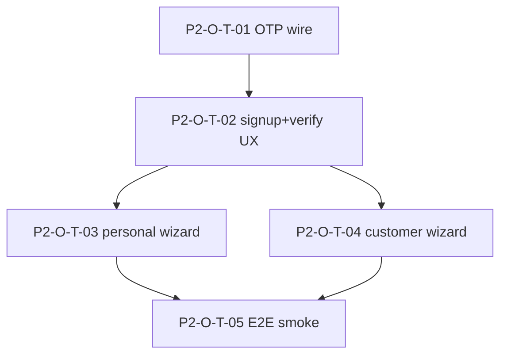

# Taskgraph — `v0.0.1-p2-onboarding` (Signup + verify + onboarding)

> **Status: RUNNING** (orchestrated 2026-07-11, parent [#23](https://github.com/saambaby/leo-workstation/issues/23)).
> Specs: [`onboarding.md`](../features/onboarding.md), [`otp-email-verification.md`](../features/otp-email-verification.md).
> Prerequisite: P1 app shell shipped ([`v0.0.1-alpha.1-taskgraph.md`](v0.0.1-alpha.1-taskgraph.md)).

**Goal:** Close the self-service funnel for personal + customer personas against the
**alpha.6 OTP backend** — signup → in-app verify → onboarding → role home.

## Integration contract

| Aspect | Contract |
|---|---|
| Auth wire | `lib/core/auth/` (`INV-CLIENT-AUTH-REPO-1`) — signup, verify, resend, reset |
| Onboarding wire | `OnboardingRepository` — catalog, profiles, org, invitations only |
| Router | `emailVerificationPending` (A1), context guards (`INV-CLIENT-ROUTE-GUARD-1`) |
| Backend dep | `leo-api` alpha.6+ OTP verify/reset (`/auth/resend-verify`, `/auth/reset-password/verify`) |

## Waves

| Wave | Gate | Tasks |
|---|---|---|
| **W1 — OTP + signup** | manual | P2-O-T-01, P2-O-T-02 |
| **W2 — Wizards** | manual | P2-O-T-03, P2-O-T-04 (parallel) |
| **W3 — E2E smoke** | manual | P2-O-T-05 |

## Tasks

| ID | Title | Spec | Depends on |
|---|---|---|---|
| **P2-O-T-01** | core/auth OTP wire vs alpha.6 | `otp-email-verification.md` | — |
| **P2-O-T-02** | signup + verify UX (metadata redirect) | `otp-email-verification.md` | P2-O-T-01 |
| **P2-O-T-03** | personal onboarding wizard | `onboarding.md` | P2-O-T-02 |
| **P2-O-T-04** | customer onboarding wizard | `onboarding.md` | P2-O-T-02 |
| **P2-O-T-05** | E2E smoke (manual) | `onboarding.md` | P2-O-T-03, P2-O-T-04 |

## DAG

## Out of scope (P2 MVP taskgraph — separate carve)

- `realtime` WSS feature
- `interpreter-workstation` / `customer-call` / `dispatch-portal` session flows
- Full `affiliations` feature (onboarding links with copy only)
- LSP signup/onboarding (leo-web)
