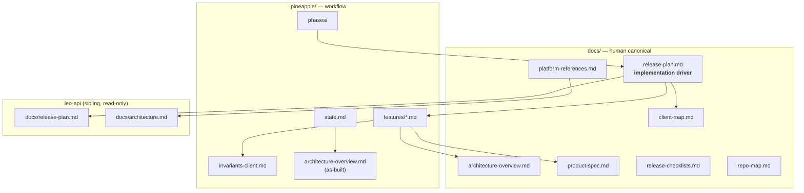

# leo-workstation — Documentation Restructure Plan

> **Purpose:** Align this repo’s documentation with the **leo-api** model — stable human docs in `docs/`, workflow artifacts in `.pineapple/`, and **`docs/release-plan.md` as the single implementation driver** sequenced against the same version map as the API.
>
> **How to use:** Open **leo-workstation** as your Cursor workspace root. Paste the [Agent prompt](#agent-prompt) into a new Agent-mode chat, or work through the [execution phases](#execution-phases) manually.
>
> **Status:** Planned — not yet executed.

---

## Table of contents

1. [Why restructure](#why-restructure)
2. [Where to run this](#where-to-run-this)
3. [Current problems](#current-problems)
4. [Target structure](#target-structure)
5. [Release plan rewrite](#release-plan-rewrite)
6. [Execution phases](#execution-phases)
7. [Appendix — detailed requirements](#appendix--detailed-requirements)
8. [Acceptance criteria](#acceptance-criteria)
9. [What not to do](#what-not-to-do)
10. [Agent prompt](#agent-prompt)

---

## Why restructure

The Leo platform now treats **leo-api** as the source of truth for platform architecture, product rules, and version sequencing. The workstation repo has drifted:

- Stale **copied** platform docs under `docs/platform/` that will diverge from leo-api on day one.
- Feature specs in `docs/features/` while Pineapple and leo-api keep features under `.pineapple/features/`.
- A **release plan** that skips API spine versions (`alpha.2`–`alpha.5`) the backend has already carved.
- Auth specs that predate **unified signup**, **multi-membership login**, and the `platform_admin` role slug.

After this migration, anyone (human or agent) implementing the Flutter client reads **`docs/release-plan.md` first**, then drills into `.pineapple/features/` for slice detail.

---

## Where to run this

| Workspace | Verdict |
|---|---|
| **`leo-workstation`** (recommended) | Correct Cursor rules, `.pineapple/config.yml`, git repo, and `state.md` |
| `leo-api` | Wrong — easy to commit workstation changes to the API repo; Pineapple paths point at API artifacts |

**Prerequisite:** `../leo-api` must exist as a **sibling directory** (typical monorepo layout: `leo/leo-api`, `leo/leo-workstation`). Treat it as **read-only** — link, don’t copy.

---

## Current problems

| Issue | Today | Risk |
|---|---|---|
| Split doc homes | Features in `docs/features/`; Pineapple expects `.pineapple/features/` | Agents don’t know canonical paths |
| `docs/platform/` copies | Four large files synced from leo-api | Drift — API is at alpha.5 with unified signup, affiliations, `platform_admin` |
| Release plan gap | Jumps `alpha.1` → `v0.0.1` (P2) | Client work won’t track API contract changes |
| Stale operational state | `state.md` / phases INDEX say backend alpha.2 | Wrong auth/MFA assumptions for P1 |
| Architecture refs | Cite `platform/product-spec.md` | Wrong role names, signup flows, org model |
| `config.yml` mismatch | `features_dir: docs/features/`, platform paths under `docs/platform/` | Pineapple commands target wrong files |

### What’s already good (keep)

- `docs/client-map.md` — rich, client-owned (correct inverse of leo-api’s one-page glimpse)
- `docs/architecture-overview.md` — solid target MVVM/Riverpod doc (update refs, don’t rewrite)
- `.pineapple/invariants-client.md` — right place for `INV-CLIENT-*`
- `.pineapple/architecture-overview.md` + `.pineapple/product-spec.md` — as-built reverse-engineering (matches leo-api pattern)

---

## Target structure

### `docs/` — canonical human docs

| File | Purpose | leo-api analogue |
|---|---|---|
| `README.md` | Index + version map table | `leo-api/docs/README.md` |
| `release-plan.md` | **Primary implementation driver** | `leo-api/docs/release-plan.md` |
| `architecture-overview.md` | This client — MVVM, Riverpod, routing, media | `leo-api/docs/architecture-overview.md` |
| `client-map.md` | Routes, roles, devices, journeys (full detail) | `leo-api/docs/client-map.md` (glimpse only) |
| `product-spec.md` | **New** — client-scoped what/why | `leo-api/docs/product-spec.md` (platform-wide) |
| `release-checklists.md` | Cut-the-release gates for this repo | `leo-api/docs/release-checklists.md` |
| `repo-map.md` | This repo layout + doc ownership | `leo-api/docs/repo-map.md` |
| `platform-references.md` | **New** — thin pointer index to `../leo-api/docs/` | *(replaces `docs/platform/`)* |

**Do not put in `docs/`:** feature specs, taskgraphs, orchestration state, as-built reverse-engineering.

### `.pineapple/` — workflow + agent artifacts

| Path | Action |
|---|---|
| `features/` | **Move** from `docs/features/` |
| `config.yml` | Update artifact paths (see [Appendix](#appendix--detailed-requirements)) |
| `phases/INDEX.md` | Sync backend phase to leo-api current (alpha.5) |
| `state.md` | Update as-built + migration status |
| `features/auth.md` | Update for alpha.4 API contract |
| Keep unchanged | `invariants-client.md`, `code-map.md`, as-built `architecture-overview.md`, `product-spec.md` |

### Remove

- **`docs/platform/`** — entire folder (stale copies; link to leo-api instead)
- **`docs/features/`** — after move to `.pineapple/features/`

### Doc dependency graph (target)



---

## Release plan rewrite

**Principle:** Every workstation version is a **strict superset** of the prior, keyed to the **same version tags** as `../leo-api/docs/release-plan.md`.

Each version section must include:

1. **Goal** — one existential question
2. **Features** — links to `.pineapple/features/*.md`
3. **Screens/routes** — link to `client-map.md`
4. **API dependencies** — endpoints/events from the matching leo-api release-plan section
5. **Definition of Done** — checkboxes
6. **Explicitly deferred**

### Version map (add missing sections)

| Version | Client scope | API dependency |
|---|---|---|
| `v0.0.1-alpha.1` | App shell — auth, router, theme, WSS | P1 auth spine |
| `v0.0.1-alpha.2` | **No client release** — backend-only CLI | Platform admin bootstrap |
| `v0.0.1-alpha.3` | **No client release** — superseded by alpha.4 | LSP public signup (deprecated path) |
| `v0.0.1-alpha.4` | Auth contract: multi-membership login, tenant picker, `switch-tenant`, tenant-less token | Unified identity & signup |
| `v0.0.1-alpha.5` | Minimal pre-P2: `platform_admin` slug, affiliation context if needed | Interpreter affiliations |
| `v0.0.1` | **MVP** — Vonage loop (existing P2 content) | P2 session/matching |
| `v0.1.0` → `v1.0.0` | Keep existing P3–P8 sections; tighten API cross-refs | Matching API sections |

**Critical path (unchanged):** P1 shell → **P2 MVP loop**. Alpha.4/5 are auth-contract hardening on the P1 shell — don’t block P2 feature planning, but `auth.md` must reflect alpha.4 before implementation.

**P1 auth target (default):** Document against the **alpha.4** auth contract from day one. Do not document deprecated `POST /auth/lsp-signup` or single-membership-only login.

### Convention line (update in release-plan header)

| Citation | Resolves to |
|---|---|
| `ps §N` | `docs/product-spec.md` (client-scoped) |
| `arch §N` | `docs/platform-references.md` → `../leo-api/docs/architecture.md` |
| `decision-log` BD* | `docs/platform-references.md` → `../leo-api/docs/decision-log.md` |

---

## Execution phases

### Phase 1 — Baseline (read-only)

1. Read `../leo-api/docs/README.md`, `release-plan.md`, `client-map.md` — note alpha.2–alpha.5 spine and `platform_admin`.
2. Read current workstation: `docs/README.md`, `docs/release-plan.md`, `.pineapple/config.yml`, `.pineapple/state.md`, `.pineapple/phases/INDEX.md`.
3. Inventory all files referencing `docs/platform/` or `docs/features/`:

   ```bash
   rg 'docs/platform/|docs/features/|platform/product-spec' \
     --glob '*.md' --glob '*.yml' --glob '*.mdc' \
     docs .pineapple CLAUDE.md README.md .cursor
   ```

### Phase 2 — Remove duplication

1. Create `docs/platform-references.md` (template in [Appendix](#platform-referencestemplate)).
2. Delete `docs/platform/` (prefer delete over archive).
3. `git mv docs/features/ .pineapple/features/` and fix internal links per [link rewrite table](#link-rewrite-after-feature-move).

### Phase 3 — Rewrite `docs/release-plan.md` ⭐ highest priority

1. Add version map table matching leo-api (alpha.1–alpha.5, v0.0.1 … v1.0.0).
2. Add alpha.2, alpha.3 (explicit “no client release”), alpha.4, alpha.5 sections.
3. Copy **API dependencies** blocks from matching `../leo-api/docs/release-plan.md` sections.
4. Keep existing P2–P8 content; tighten cross-refs.
5. Update convention line in header.

### Phase 4 — New `docs/product-spec.md`

Write client-scoped product spec (outline in [Appendix](#docsproduct-specmd-outline)). Link to leo-api for platform-wide rules.

### Phase 5 — Update indexes and cross-refs

Update links in:

- `docs/README.md` (leo-api-style index table)
- `docs/architecture-overview.md`
- `docs/client-map.md`
- `docs/repo-map.md`
- `docs/release-checklists.md` (add alpha.4 gates — see [Appendix](#release-checklists-alpha4-gates))
- `CLAUDE.md`
- `.cursor/rules/pineapple-project.mdc`
- Root `README.md`
- All `.pineapple/features/*.md`

### Phase 6 — Pineapple operational sync

1. `.pineapple/state.md` — backend at **alpha.5**, migration status.
2. `.pineapple/phases/INDEX.md` — forward target P1-alpha.1; note alpha.4 auth dependency.
3. Create `.pineapple/phases/v0.0.1-alpha.1.md` (phase carve stub).
4. Update `.pineapple/features/auth.md` per [alpha.4 auth requirements](#alpha4-auth-requirements).
5. Update `.pineapple/config.yml` per [target config](#target-pineappleconfigyml).

**Historical note:** Leave `.pineapple/phases/phase-0-scaffold.md` as historical record; only fix links if they claim current truth.

### Phase 7 — Verify

```bash
rg 'docs/platform/|docs/features/' \
  --glob '*.md' --glob '*.yml' --glob '*.mdc' \
  docs .pineapple CLAUDE.md README.md .cursor
```

Expected: **zero hits** in active docs.

Additional checks:

- [ ] Workstation version table tags match leo-api
- [ ] Every `ps §N` / `arch §N` resolves via local `product-spec.md` or `platform-references.md`
- [ ] `auth.md` has no `superadmin` slug; uses `platform_admin`

---

## Appendix — detailed requirements

### Prerequisite

`../leo-api` sibling must exist. If not, **stop and ask** — do not invent API surface.

### Target `.pineapple/config.yml`

```yaml
# Client docs in docs/; platform truth linked via docs/platform-references.md

adoption: map-in-place

artifacts:
  product_spec: docs/product-spec.md
  product_spec_as_built: .pineapple/product-spec.md
  architecture: docs/architecture-overview.md
  architecture_as_built: .pineapple/architecture-overview.md
  invariants: .pineapple/invariants-client.md
  invariants_platform: ../leo-api/.pineapple/invariants.md
  phases_dir: .pineapple/phases/
  phases_current: .pineapple/phases/INDEX.md
  features_dir: .pineapple/features/
  code_map: .pineapple/code-map.md
  client_map: docs/client-map.md
  release_plan: docs/release-plan.md
  release_checklists: docs/release-checklists.md
  platform_refs: docs/platform-references.md
  repo_map: docs/repo-map.md
  state: .pineapple/state.md

tracker: github-issues

tracker_config:
  backend: gh
  canonical_repo: leo-api

notes:
  - "Platform INV-* rules live in ../leo-api/.pineapple/invariants.md — client copies INV-CLIENT-* locally."
  - "Platform docs: link via docs/platform-references.md — never copy into this repo."
  - "As-built state in .pineapple/state.md; target arch in docs/architecture-overview.md."
  - "Implementation order: docs/release-plan.md → .pineapple/features/*.md"
```

### `docs/platform-references.md` template

```markdown
# Platform references (canonical in leo-api)

Do not copy these into this repo. Edit upstream in **leo-api**, then link from here.

| Topic | Canonical path (sibling monorepo) |
|---|---|
| Platform architecture | `../leo-api/docs/architecture.md` |
| Platform architecture (API-scoped) | `../leo-api/docs/architecture-overview.md` |
| Platform product spec | `../leo-api/docs/product-spec.md` |
| Decision log | `../leo-api/docs/decision-log.md` |
| Backend release plan | `../leo-api/docs/release-plan.md` |
| Platform release gates | `../leo-api/docs/release-checklists.md` |
| Pre-launch checklist | `../leo-api/docs/pre-launch-checklist.md` |
| Platform invariants | `../leo-api/.pineapple/invariants.md` |
| Backend feature specs | `../leo-api/.pineapple/features/INDEX.md` |

## Citation conventions

| Shorthand | Resolve via |
|---|---|
| `arch §N` | `../leo-api/docs/architecture.md` |
| `ps §N` (platform-wide) | `../leo-api/docs/product-spec.md` |
| `ps §N` (client-owned) | `docs/product-spec.md` |
| `BD*` decisions | `../leo-api/docs/decision-log.md` |
| `INV-*` (platform) | `../leo-api/.pineapple/invariants.md` |
| `INV-CLIENT-*` | `.pineapple/invariants-client.md` |
```

### `docs/product-spec.md` outline

Write a **client-scoped** spec (~2–4 pages). Suggested sections:

1. **Vision** — one Flutter binary, three ops workstations (interpreter · customer · dispatcher); role-routed after login (BD1).
2. **In-scope personas** — interpreter, customer_user, sub_admin, lsp_admin (dispatch surfaces only for admins).
3. **Out of scope (BD7)** — admin CRUD, reports, rate cards, billing exports, signup wizards → `leo-web`; platform admin → `leo-web`.
4. **Device matrix** — summary table + pointer to `client-map.md` for full matrix and build sequencing.
5. **UI & accessibility** — Cupertino-first (INV-CLIENT-UI-1), night mode, semantics; deaf-first client obligations (cite leo-api ps §15 via `platform-references.md`).
6. **Security (client)** — secure token storage (D6/D7), cert pinning (D13), no PHI at rest (INV-CLIENT-PHI-1), media tokens only (INV-CLIENT-MEDIA-1).
7. **Platform rules** — link to `../leo-api/docs/product-spec.md` for marketplace-wide business rules not duplicated here.

### Link rewrite after feature move

When `docs/features/` → `.pineapple/features/`:

| Old path (from feature spec) | New path |
|---|---|
| `../release-plan.md` | `../../docs/release-plan.md` |
| `../client-map.md` | `../../docs/client-map.md` |
| `../platform/product-spec.md` | `../../docs/product-spec.md` |
| `../../.pineapple/invariants-client.md` | `../invariants-client.md` |
| `../architecture-overview.md` | `../../docs/architecture-overview.md` |

### Alpha.4 auth requirements

Update `.pineapple/features/auth.md` to document:

| Topic | Requirement |
|---|---|
| Role slug | `platform_admin` everywhere — **not** `superadmin` |
| JWT claims | `{ sub, role, tenant_id? }` — `tenant_id` optional for tenant-less interpreters |
| Multi-membership login | When 2+ active memberships → **tenant/membership picker** before role redirect |
| Tenant-less login | 0-membership interpreter → tenant-less token → redirect to `/idle` |
| Switch tenant | `POST /auth/switch-tenant` re-mints token; required when user changes LSP context |
| MFA | Challenged on **login and switch-tenant** for `platform_admin`, `lsp_admin`, `sub_admin` (INV-AUTH-3 refined) |
| Phasing in spec | **alpha.1** — storage, interceptor, router wiring; **alpha.4** — membership UX |
| New UI (alpha.4) | `tenant_picker_screen.dart` or inline picker on login flow |
| Deprecated | Do not document `POST /auth/lsp-signup` |

### `web-admin-back-office.md`

- **Keep** in `.pineapple/features/` as a cross-repo reference spec.
- Add banner at top: *“Implements in `leo-web`, not `leo-workstation`.”*
- Update `INDEX.md` to mark area as `leo-web`.

### Release checklists — alpha.4 gates

Add to `docs/release-checklists.md`:

```markdown
### `v0.0.1-alpha.4` — Auth contract (multi-membership)

- [ ] Multi-membership login → tenant picker → correct role home
- [ ] Tenant-less interpreter login → `/idle` without error
- [ ] `switch-tenant` re-mints token; MFA re-challenged for privileged roles
- [ ] JWT handling uses `platform_admin` slug (no `superadmin` in code or docs)
- [ ] All alpha.1 app-shell gates still pass
```

### Ongoing content rules

| Rule | Rationale |
|---|---|
| Implement from `docs/release-plan.md` only | Single sequencing source |
| Platform truth lives in leo-api | Link via `platform-references.md`; never copy |
| Feature specs live in `.pineapple/features/` | Matches leo-api; keeps `docs/` readable |
| As-built vs target | Target → `docs/architecture-overview.md`; as-built → `.pineapple/` + `state.md` |
| Version tags align | Tag workstation when *its* DoD passes, even for narrow alpha slices |

---

## Acceptance criteria

Migration is **done** when all of the following pass:

- [ ] No `docs/platform/` directory
- [ ] No `docs/features/` directory
- [ ] Feature specs only under `.pineapple/features/`
- [ ] `docs/release-plan.md` includes alpha.1–alpha.5 + v0.0.1 … v1.0.0
- [ ] Each release-plan version section has an **API dependencies** block
- [ ] `docs/product-spec.md` exists (client-scoped)
- [ ] `docs/platform-references.md` exists (links only, no copies)
- [ ] `.pineapple/config.yml` matches [target config](#target-pineappleconfigyml)
- [ ] `auth.md` reflects multi-membership login, `switch-tenant`, `platform_admin`
- [ ] `.pineapple/state.md` backend version = leo-api current phase (alpha.5)
- [ ] `rg` audit returns zero hits for `docs/platform/` and `docs/features/` in active docs
- [ ] `CLAUDE.md` and `.cursor/rules/pineapple-project.mdc` point to new paths

---

## What not to do

- Don’t copy `leo-api/docs/architecture.md` into this repo.
- Don’t put taskgraphs or orchestration JSON in `docs/`.
- Don’t merge the full platform product spec into this repo — write a thin client `product-spec.md` instead.
- Don’t implement Flutter code in the migration session.
- Don’t edit leo-api files.
- Don’t commit unless explicitly asked.

---

## Agent prompt

Copy everything in the block below into a new **Agent-mode** chat with **leo-workstation** as the workspace root.

---

### Task: Execute DOC-RESTRUCTURE-PLAN.md

Read and follow [`DOC-RESTRUCTURE-PLAN.md`](./DOC-RESTRUCTURE-PLAN.md) in this repo — including the full **Appendix**. This is a **docs-only** migration.

**Constraints:**
- Do **not** edit `../leo-api` — read-only reference.
- Do **not** copy large platform docs — use `docs/platform-references.md`.
- Do **not** implement Flutter code.
- Do **not** commit unless I explicitly ask.
- Match prose style in `../leo-api/docs/README.md` and `../leo-api/docs/release-plan.md`.

**Prerequisite:** `../leo-api` sibling must exist. If missing, stop and ask.

**P1 auth target:** Document against **alpha.4** auth contract from day one.

**Execute in order:** Phase 1 → Phase 7 from the plan.

**Highest priority:** Phase 3 (`docs/release-plan.md` rewrite with alpha.2–alpha.5 + API dependency blocks).

**After moving features:** Apply the [link rewrite table](./DOC-RESTRUCTURE-PLAN.md#link-rewrite-after-feature-move).

**Must update:** `.pineapple/features/auth.md` per [alpha.4 auth requirements](./DOC-RESTRUCTURE-PLAN.md#alpha4-auth-requirements).

**Must keep:** `.pineapple/features/web-admin-back-office.md` with leo-web banner.

**Verification:** Run the `rg` commands in Phase 1 and Phase 7; confirm all [acceptance criteria](./DOC-RESTRUCTURE-PLAN.md#acceptance-criteria).

**Deliverable when finished:**
1. Short summary of what moved/changed
2. List of files created / deleted / moved
3. Any open decisions left for me
4. Suggested next step (`/pineapple:feature-spec` for P1 or `/pineapple:cross-spec-audit`)

---

## Optional: split across two sessions

| Session | Scope | Outcome |
|---|---|---|
| **Session 1** | Phases 2 + 3 — delete `platform/`, move features, rewrite `release-plan.md` | Unblocks implementation planning |
| **Session 2** | Phases 4–7 — `product-spec.md`, indexes, Pineapple sync, verification | Polishes agent onboarding |

---

## After migration

1. Run `/pineapple:cross-spec-audit` on updated feature specs.
2. Run `/pineapple:feature-spec` loop for P1 features against new release plan.
3. Delete or archive `DOC-RESTRUCTURE-PLAN.md` once migration is merged (optional — can keep as historical record).

---

*Created: 2026-06-24 · Companion: leo-api `docs/README.md`, `docs/release-plan.md`*
