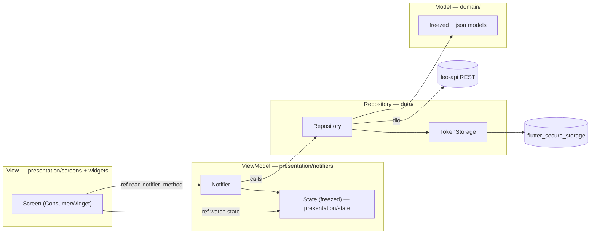
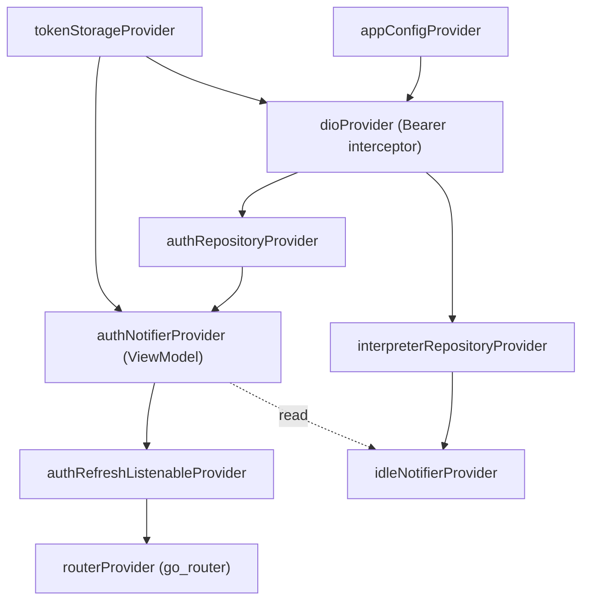
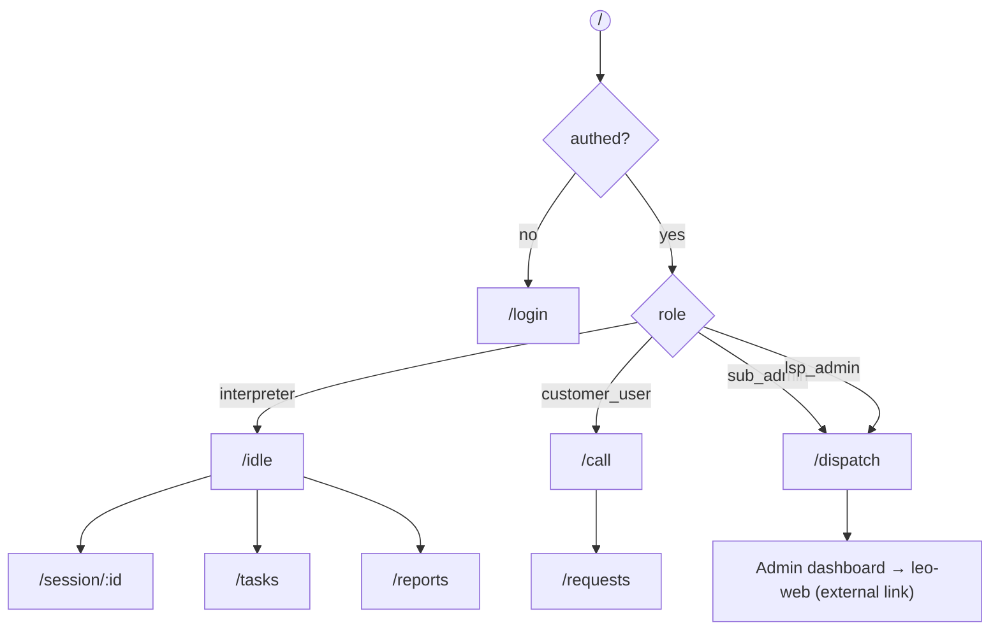
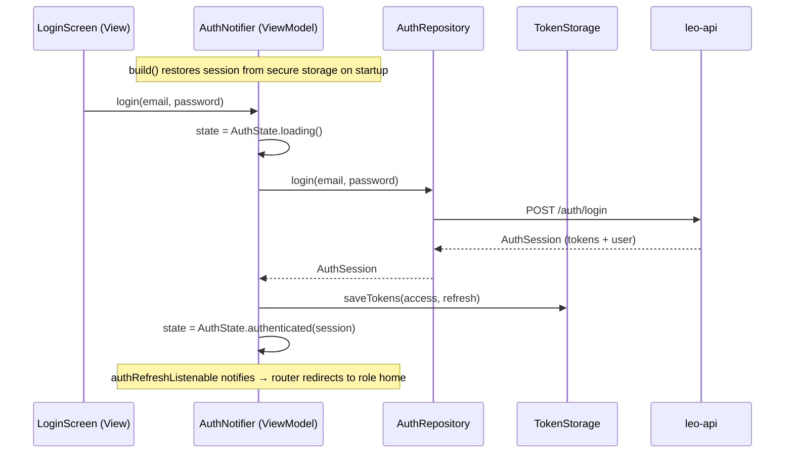
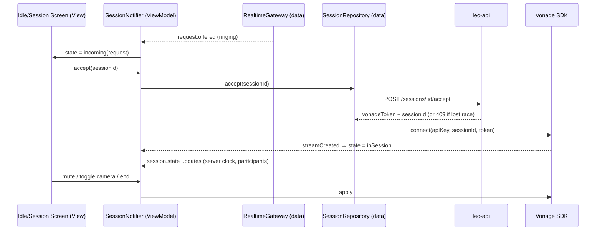
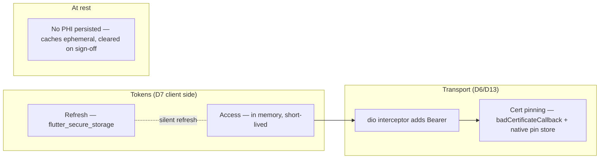
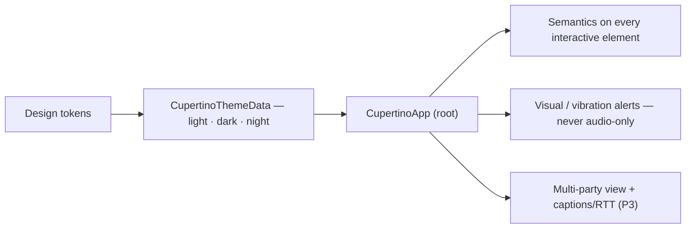

# leo-workstation — Architecture Overview

> The Flutter client architecture for Leo, organized **feature-first** with an **MVVM + repository** pattern. Client product rules: [`./product-spec.md`](./product-spec.md); platform-wide `ps §N` via [`./platform-references.md`](./platform-references.md). Build order: [`./release-plan.md`](./release-plan.md) (**canonical for this repo**). Backend: `leo-api` REST + WSS.

> **Client split (BD7, refined 2026-06-29):** This repo owns **realtime ops** — interpreter, customer (desktop/tablet until v0.1.0), **dispatch portal** — **plus the full self-service signup + verification + onboarding for personal + customer** (`a-signup`, `a-verify`, `o-personal`, `o-customer`). LSP back-office (reports, billing, users, settings, **LSP signup + LSP onboarding**) lives in **`leo-web` (Next.js)**. See [`./client-map.md`](./client-map.md).

`leo-workstation` is one Flutter codebase for **field and dispatch surfaces** — the **Interpreter Workstation**, **Customer call/requests** (desktop/tablet in P2; smartphone **v0.1.0+**), and the **Dispatch portal** (Sub-Admin + LSP Admin). LSP Admin also gets an **“Admin dashboard” link** to `leo-web` (no auto-redirect). It is a **thin, untrusted client**: all business rules live in leo-api, and **media never transits it or the backend** — the app exchanges encrypted A/V directly with Vonage (video) and joins Twilio conferences (telephony) using short-lived tokens minted by leo-api (arch §2, §4.1).

> **Theming:** **Cupertino** (`CupertinoApp` + `CupertinoThemeData`, app-wide night mode per ps §15, `INV-CLIENT-UI-1`). The scaffold is already `CupertinoApp`; the target adds `CupertinoThemeData` light/dark/night. (Earlier Material 3 baseline has been migrated off.)

---

## 1. The pattern — feature-first MVVM + repository

Every feature is a vertical slice. Within a slice the layers map onto MVVM + repository:

| MVVM role | Lives in | Implemented as |
|---|---|---|
| **View** | `presentation/screens/`, `presentation/widgets/` | Stateless/Consumer widgets — render state, dispatch intents. No logic. |
| **ViewModel** | `presentation/notifiers/` | Riverpod `Notifier` (e.g. `AuthNotifier`, `IdleNotifier`) — holds no widgets; orchestrates repositories, emits state. |
| **View state** | `presentation/state/` | `freezed` immutable state (union like `AuthState`, or `copyWith` struct like `IdleState`). |
| **Model (domain)** | `domain/` | `freezed` + `json_serializable` models mirroring the backend (e.g. `AuthSession`, `idle_models`). |
| **Repository** | `data/` | Plain classes over `dio` / secure storage (e.g. `AuthRepository`, `TokenStorage`, `InterpreterRepository`). The only layer that knows the wire. |



> Dependencies flow **View → ViewModel → Repository → wire**. The View never touches a repository or `dio` directly; the Repository never imports Flutter. State is always immutable (`freezed`).

### Feature scaffold checklist (P2+)

When adding a new slice under `lib/features/<name>/`:

1. `presentation/state/<feature>_state.dart` — `freezed` union or struct (router contract arms are frozen once wired to `go_router`).
2. `presentation/notifiers/<feature>_notifier.dart` — sole owner of async/business state for the slice.
3. `presentation/providers/<feature>_ui_provider.dart` — derived UI helpers (`isLoading`, `errorMessage`, etc.) so screens do not pattern-match state on every build.
4. Screens are `ConsumerWidget` unless they hold ephemeral `TextEditingController` / focus state.
5. No `data/` imports in views; no repository calls from widgets — dispatch intents via `ref.read(<notifier>.notifier)`.
6. `presentation/routes/<feature>_routes.dart` — exports `List<RouteBase>` (and path constants for the redirect table when the feature owns public routes). Composed in `core/router/app_router.dart`; redirect guard stays in `core/router/redirect.dart`.

Reference implementation: `features/auth/` (`AuthNotifier`, `AuthUiState`, `AuthFormShell`).

**Verification:** `flutter analyze` (+ `build_runner` when codegen changes). Do not add Flutter tests unless explicitly requested (`INV-CLIENT-TEST-1`).

---

## 2. Directory layout

```
lib/
  main.dart                     # ProviderScope + runApp(LeoApp)
  app.dart                      # LeoApp: (Cupertino)App.router, theme, watches authNotifier
  core/
    config/    app_config.dart            # apiBaseUrl, realtimeWsUrl (env-scoped)
    network/   dio_provider.dart          # Dio + auth interceptor (Bearer JWT)
    router/    app_router.dart            # composition root: routerProvider + ShellRoute
               device_class_scope.dart    # DeviceClassScope wrapper for route builders
               role_home_routes.dart       # P1 role-home placeholders (/idle, /call, /dispatch)
               redirect.dart               # pure auth redirect guard
    theme/     app_theme.dart             # Cupertino theme (light/dark/night) — migrating from Material 3
    providers/ auth_refresh_listenable.dart  # bridges authNotifier → GoRouter.refreshListenable
  features/
    auth/
      data/        auth_repository.dart, token_storage.dart
      domain/      auth_models.dart            (+ .freezed/.g)
      presentation/
        routes/    auth_routes.dart            # auth GoRoute tree + path constants
        screens/   login_screen.dart
        notifiers/ auth_notifier.dart          # ViewModel
        state/     auth_state.dart             # freezed union
    idle/
      data/        interpreter_repository.dart
      domain/      idle_models.dart
      presentation/{screens,notifiers,state,widgets}
    <feature>/ …  # session, requests, tasks, dispatch, customer/call (added per release-plan)
    # NOT in this repo: admin reports, user CRUD, rate cards — see leo-web
```

Each new feature (per [`./release-plan.md`](./release-plan.md)) is a new folder under `features/` with the same five sub-parts — slices never reach into each other's `data/`; cross-feature reads go through the other feature's notifier provider (as `IdleNotifier` reads `authNotifierProvider`).

---

## 3. Providers & wiring (Riverpod)



| Provider | Kind | Responsibility |
|---|---|---|
| `appConfigProvider` | `Provider<AppConfig>` | Environment (API base URL, WSS URL) |
| `dioProvider` | `Provider<Dio>` | HTTP client; request interceptor injects `Authorization: Bearer <access>` |
| `tokenStorageProvider` | `Provider<TokenStorage>` | Read/write/clear tokens in `flutter_secure_storage` |
| `authNotifierProvider` | `NotifierProvider<AuthNotifier, AuthState>` | Login, session restore, logout (the auth ViewModel) |
| `authRefreshListenableProvider` | `Provider<ChangeNotifier>` | Bridges auth-state changes to `GoRouter.refreshListenable` |
| `routerProvider` | `Provider<GoRouter>` | Routes + redirect guard keyed on `isAuthenticated` |
| `<feature>NotifierProvider` | `NotifierProvider` | One ViewModel per feature |

---

## 4. Navigation & role-based routing

`go_router` with a `redirect` driven by auth state; each role lands on its own shell, and **device class further gates which routes exist** (ps §15).



### Role × device surface matrix (ps §15 · BD7 build sequencing)

| Surface | Desktop / Laptop | Tablet | Smartphone |
|---|---|---|---|
| **Interpreter** | Full (idle, in-session, tasks, reports) | — | Tasks/reports read-only — **no on-demand accept** |
| **Customer** | Full (`/call`, `/requests`) | Full | **Deferred to v0.1.0+** — not in P2 MVP |
| **Sub-Admin / Dispatcher** | Full dispatch (`/dispatch`) | — | Assign / reject / transfer — actionable |
| **LSP Admin** | Dispatch + **link** to `leo-web` | — | Same mobile dispatch as sub-admin |

A `DeviceClass` derivation (from `MediaQuery`/platform) hides routes a device isn't entitled to — e.g. customer routes on smartphone are blocked until v0.1.0; interpreter **Accept** is not reachable on mobile.

### Route composition

- Feature modules own their `GoRoute` trees and path constants (`features/<name>/presentation/routes/<name>_routes.dart`).
- `routerProvider` and the pure `authRedirect` guard live in `core/router/` (`app_router.dart`, `redirect.dart`).
- `app_router.dart` is the composition root — it spreads feature route lists inside a `ShellRoute`; it does not define individual routes.
- P1 role-home placeholders (`/idle`, `/call`, `/dispatch`) live in `core/router/role_home_routes.dart`; migrate to workstation features in P2.

---

## 5. Auth & session-restore flow (reference: `AuthNotifier`)



Errors map to user-facing messages in the ViewModel (`401 → "Invalid email or password"`). The router's `refreshListenable` re-evaluates `redirect` on every auth-state change, so navigation is a pure function of state.

---

## 6. The core flow — accepting & running a session (client side)

Mirrors the backend connect sequence (arch §4.3); the client never starts the billing meter — it joins media and reflects state pushed from leo-api over WSS.



**Reconnection:** on network drop the media service re-`connect`s to the same Vonage session id held in session state — no new request, no new billing record (arch §4.2). **Conferencing & multi-party guest join** (Deaf patient + clinician + interpreter, arch §4.5) land in P3; the same media stage renders N participants plus a captions/RTT track.

---

## 7. Security (client-side)



| Control | Mechanism | Gate |
|---|---|---|
| Token storage | `TokenStorage` over `flutter_secure_storage` (Keychain/Keystore/libsecret/DPAPI) | D6 |
| Bearer injection | `dioProvider` request interceptor | — |
| Certificate pinning | `dio` `badCertificateCallback` + platform channel verifying SHA-256 pins (rotation) | D6 / D13 |
| Token lifetime | access in memory; rotating refresh; device-fingerprint header | D7 |
| No PHI on device | no local DB of patient data; session caches cleared on sign-off / background | ps §16 |

---

## 8. Accessibility (Deaf-first, WCAG 2.1 AA)

Accessibility is a **hard product requirement** (ps §15.1, legal gate L3) — semantics and night mode are front-loaded in P1.



- **Night mode is app-wide** and persisted, available to all three roles (ps §15).
- **Deaf-first** — Leo **Text** (not Voice) is the primary AI channel for Deaf users; ASL sessions are video-only; alerts are visual/vibration/SMS/push.
- **Captions / RTT and the multi-party layout** ship with P3 (scheduled + Deaf-first), per the release plan.

---

## 9. Dependency stack

| Concern | Package |
|---|---|
| State management | `flutter_riverpod` (+ `riverpod_annotation` / `riverpod_generator`) |
| Routing | `go_router` |
| HTTP | `dio` (+ auth/refresh/cert-pin interceptors) |
| Realtime | `web_socket_channel` (added with the session feature) |
| Models / serialization | `freezed` + `json_serializable` |
| Secure storage | `flutter_secure_storage` |
| Video media | Vonage Video Flutter SDK (added with the session feature) |
| Icons / theme | `cupertino_icons` |

Codegen: `dart run build_runner build --delete-conflicting-outputs` for `freezed` / `json_serializable` / `riverpod_generator`.

Platform targets: **macOS / Windows / Linux** (interpreter + admin desktop), **iOS / Android** (customer; interpreter & admin read-only/actionable per ps §15).

---

## 11. Feature architecture index

Each feature is a vertical slice under `lib/features/` (see [`../.pineapple/features/INDEX.md`](../.pineapple/features/INDEX.md)). Target wiring:

| Feature | lib path | Key providers | Backend deps (P*) |
|---|---|---|---|
| **core-shell** | `core/`, `app.dart` | `appConfigProvider`, `routerProvider`, `deviceClassProvider` | — |
| **auth** | `features/auth/` | `authNotifierProvider`, `tokenStorageProvider`, `dioProvider` | P1 auth |
| **realtime** | `features/realtime/` | `realtimeGatewayProvider` | P1 WSS |
| **interpreter-workstation** | `features/idle/` | `idleNotifierProvider` | P2 session |
| **customer-call** | `features/call/`, `requests/` | `callNotifierProvider` | P2 session |
| **dispatch-portal** | `features/dispatch/` | `dispatchNotifierProvider` | P2 session admin |
| **session-shared** | `features/session/` | `sessionNotifierProvider`, Vonage service | P2 Vonage tokens |
| **web-admin-back-office** | *web admin repo* | — | P2→P4 REST |

Cross-feature rule: notifiers may `ref.read` other notifiers; **never** import another feature's `data/` layer.

---

## 12. Where to go next

- **What to build, in order:** [`./release-plan.md`](./release-plan.md) (per-version screens, device targets, accessibility, DoD).
- **Release gates (this repo):** [`./release-checklists.md`](./release-checklists.md).
- **Client product rules:** [`./product-spec.md`](./product-spec.md).
- **Platform-wide picture (backend + infra):** [`./platform-references.md`](./platform-references.md) → `../leo-api/docs/architecture.md`.
